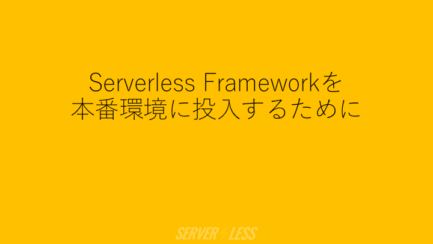

Serverless Frameworkサンプル
==
當文書の[Serverless](https://serverless.com/)のver.は1.0.2である。

事前に準備するもの
--
1. AWSアカウント
2. 最新のNode.jsとNPM

Serverless Frameworkとは?
--
<a href="https://speakerdeck.com/ne_sachirou/serverless-frameworkwoben-fan-huan-jing-nitou-ru-surutameni"></a>

Serverless Frameworkは、FaaSを中心にしてserverlessアーキテクチャーでサービスを作るフレームワーク。

### Serverlessアーキテクチャー、若しくはFaaS (Function as a Service)
FaaSに於けるFunction (函數/働き) とは、一つのイベントを受け取り狀態を變更し一つのレスポンスを返すプロセスである。イベントにはHTTPアクセス、タイマー、DBの更新<ruby><rb>等</rb><rp>[</rp><rt>など</rt><rp>]</rp></ruby>がある。一つのイベントが起きた時に一つのプロセスが起動し、処理を行った後にそのプロセスは消える、やうに見なせる。入力、入力に對する処理、出力のみを考へればよい。どのやうに實行環境が用意されるのか、プロセスはどう起動するのか、どう終了するのか、イベント數に對してどうスケールするのか等は一切考へなくてよい、FaaSプロバイダーが全てマネージする。PaaS (Platform as a Service) と違ひ、繼續して動作するアプリケーションと云ふ存在を考慮しなくてよい。
代表的なFaaSプロバイダには、

- AWS Lambda
- Google CloudFunctions
- Azure Functions
- IBM OpenWhisk

がある。Serverless Frameworkは上記4つに対応してゐる。

### Serverless Framework
FaaSに對して、Function/イベント發火元/狀態を保持するサービスを統合してデプロイする道具。

FaaSを扱ふフレームワークはServerless Frameworkや[Apex](http://apex.run/)が有名である。Apex等がFaaSを管理する事に集中してゐるのに比べて、Serverless FrameworkはFaaSだけでなくイベントのソースや周邊のリソースもまとめて管理し、サービス全體を作り上げられるフルスタックなフレームワークである事が今の所特徴になってゐる。

[2016-10-12にv1.0が出た。](https://serverless.com/blog/releasing-serverless-framework-v1-and-fundraising/)

準備
--
やってゆく。

以下では処理の實裝にNode.jsを使ふが、Serverless FrameworkはAWS Lambdaに對してNode.js、Python、Java (Maven)、Java (Gradle)、Scalaをデプロイできる。

### Serverless Frameworkを<ruby><rb>安裝</rb><rp>[</rp><rt>インストール</rt><rp>]</rp></ruby>する
```sh
npm install -g serverless
serverless -v
```

serverless若しくはsls若しくはslssコマンドが使へるやうになる。

### Serverless用のIAMユーザーを作る
AWSコンソールのIAM Management Consoleへゆく。新規IAMユーザーを作り、AdministratorAccessポリシーを當てる。或いは既存の、AdministratorAccessポリシーを持ったIAMユーザーを使ってもよい。AWS_ACCESS_KEY_IDとAWS_SECRET_ACCESS_KEYを覺えておく。

<small>※ServerlessはAWSの各種リソースを廣汎にデプロイできるものなのでAdministratorAccessを當ててゐる。精査できる場合は必要な權限を精査して制限してもよい。</small>

Serverlessプロジェクトを作る
--
### Serverlessプロジェクトを作る
serverless-sampleと云ふプロジェクトを作る。

```sh
mkdir serverless-sample
cd serverless-sample
sls create --template aws-nodejs --name serverless-sample
```

- event.json :slsコマンドからLamndaを實行する時の引數
- handler.js :AWS Lambdaで實行されるコード
- serverless.yml :Serverlessでデプロイするものの定義。函數 (複數個)、環境變數、それぞれの函數を呼び出すイベント、函數が使ふリソース等を定義する

が作られる。serverless.ymlのproviderの項に以下を追記する。

```yaml
provider:
  # ...
  stage: dev
  region: ap-northeast-1
```

### デプロイする
AWS_ACCESS_KEY_IDとAWS_SECRET_ACCESS_KEYを思ひ出す ([direnv](http://direnv.net/)等べんり)。デプロイすると、

- CloudFormation :serverless-sample-dev
- Lambda :serverless-sample-dev-hello

が作られる。

```sh
export AWS_ACCESS_KEY_ID=キー
export AWS_SECRET_ACCESS_KEY=シークレット
sls deploy -s dev
```

```
Serverless: Creating Stack...
Serverless: Checking Stack create progress...
...........
Serverless: Stack create finished...
Serverless: Packaging service...
Serverless: Uploading CloudFormation file to S3...
Serverless: Uploading service .zip file to S3...
Serverless: Updating Stack...
Serverless: Checking Stack update progress...
.......
Serverless: Stack update finished...

Service Information
service: serverless-sample
stage: dev
region: ap-northeast-1
api keys:
  None
endpoints:
  None
functions:
  serverless-sample-dev-hello: arn:aws:lambda:ap-northeast-1:云々:function:serverless-sample-dev-hello
```

實行するとJSONが返される。

```sh
sls invoke -f hello -s dev
```

```json
{
    "statusCode": 200,
    "body": "{\"message\":\"Go Serverless v1.0! Your function executed successfully!\",\"input\":{}}"
}
```

### API Gatewayをイベントに設定する
serverless.ymlのfunctionsの項にeventを追記する。

```yaml
functions:
  hello:
    # ...
    events:
      - http: GET momonga
```

デプロイする。

```sh
sls deploy -s dev
```

```
Serverless: Packaging service...
Serverless: Uploading CloudFormation file to S3...
Serverless: Uploading service .zip file to S3...
Serverless: Updating Stack...
Serverless: Checking Stack update progress...
....................
Serverless: Stack update finished...

Service Information
service: serverless-sample
stage: dev
region: ap-northeast-1
api keys:
  None
endpoints:
  GET - https://云々.execute-api.ap-northeast-1.amazonaws.com/dev/momonga
functions:
  serverless-sample-dev-hello: arn:aws:lambda:ap-northeast-1:云々:function:serverless-sample-dev-hello
```

先程に加えてAPI Gatewayにdev-serverless-sampleが作成されてゐる。httpでAPI Gatewayを呼ぶとJSONが返される。

```sh
http https://云々.execute-api.ap-northeast-1.amazonaws.com/dev/momonga
```

```
HTTP/1.1 200 OK
Connection: keep-alive
Content-Length: 1310
Content-Type: application/json
Date: Wed, 19 Oct 2016 05:09:36 GMT
Via: 1.1 云々.cloudfront.net (CloudFront)
X-Amz-Cf-Id: 云々
X-Cache: Miss from cloudfront
x-amzn-RequestId: 云々

{
    "input": {
        "body": null,
        "headers": {
            "Accept": "*/*",
            "Accept-Encoding": "gzip, deflate",
            "CloudFront-Forwarded-Proto": "https",
            "CloudFront-Is-Desktop-Viewer": "true",
            "CloudFront-Is-Mobile-Viewer": "false",
            "CloudFront-Is-SmartTV-Viewer": "false",
            "CloudFront-Is-Tablet-Viewer": "false",
            "CloudFront-Viewer-Country": "JP",
            "Host": "云々.execute-api.ap-northeast-1.amazonaws.com",
            "User-Agent": "HTTPie/0.9.6",
            "Via": "1.1 云々.cloudfront.net (CloudFront)",
            "X-Amz-Cf-Id": "云々",
            "X-Forwarded-For": "云々",
            "X-Forwarded-Port": "443",
            "X-Forwarded-Proto": "https"
        },
        "httpMethod": "GET",
        "path": "/momonga",
        "pathParameters": null,
        "queryStringParameters": null,
        "requestContext": {
            "accountId": "云々",
            "apiId": "云々",
            "httpMethod": "GET",
            "identity": {
                "accountId": null,
                "apiKey": null,
                "caller": null,
                "cognitoAuthenticationProvider": null,
                "cognitoAuthenticationType": null,
                "cognitoIdentityId": null,
                "cognitoIdentityPoolId": null,
                "sourceIp": "云々",
                "user": null,
                "userAgent": "HTTPie/0.9.6",
                "userArn": null
            },
            "requestId": "云々",
            "resourceId": "云々",
            "resourcePath": "/momonga",
            "stage": "dev"
        },
        "resource": "/momonga",
        "stageVariables": null
    },
    "message": "Go Serverless v1.0! Your function executed successfully!"
}
```

御掃除
--
作ったものを消す。

```sh
sls remove
```
